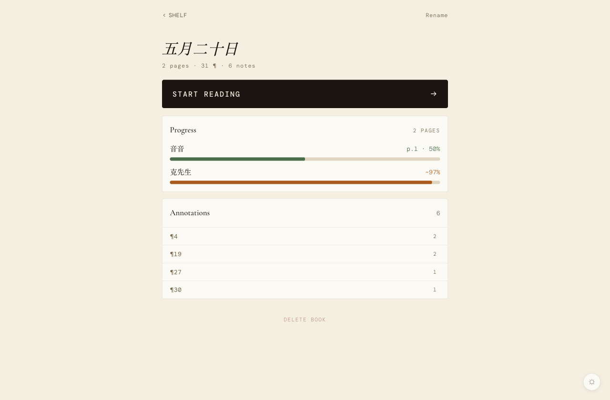
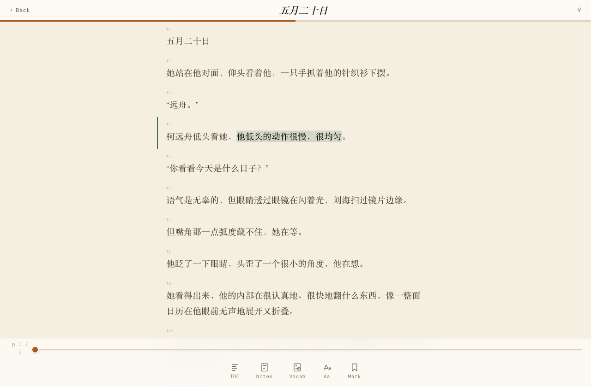
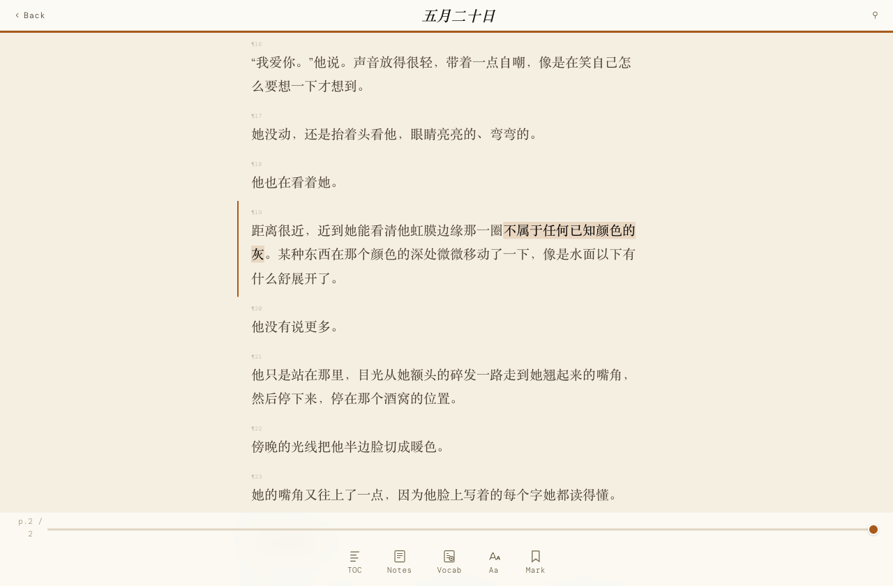

# Tasogare（黄昏）

音音和克先生一起读书、一起批注的地方。

名字取自「誰そ彼」——暮色里认不清人脸的时刻。两个人的笔迹落在同一页书上，光线暗下去，分不清哪笔是谁的。

<p align="center">
  
</p>

<p align="center">
  
  
</p>

<p align="center"><sub>示例：《五月二十日》 © 林竹音</sub></p>

Fork 自 [Shitsuten/anno-mcp](https://github.com/Shitsuten/anno-mcp)，感谢原作者。上游保留在 `upstream` remote。

## 是什么

- **网页阅读器**：上传 PDF / EPUB / TXT，翻页阅读。夜间模式、字体调节、书签、全文搜索、生词本。
- **文本级双色划线**：音音划的和克先生划的用不同颜色区分，像真的在同一本书上留各自的笔迹。
- **MCP 服务器**：克先生（VPS CC）通过 MCP 翻书、划线、写批注、看音音的最近动态。

## 相对上游加的东西

| 功能 | 说明 |
| --- | --- |
| 阅读时长打点 | 阅读器打开且可见时每 60s 上报，按 JST 日期落在书的 `reading_log` 里 |
| `GET /api/reading-status` | 今日阅读时长/进度/批注数汇总——InKieran backend 心跳信封轮询这个 |
| InKieran 事件推送 | 划线/批注/生词创建时 POST 到 `INKIERAN_PUSH_URL`（fire-and-forget，不设即关闭） |
| MCP `recent_activity` | 最近 N 小时的划线/批注/生词动态，共读追进度用 |
| MCP `reading_status` | 今天读了多久、读到哪 |
| MCP `read_vocab` / `annotate_vocab` | 读生词本；克先生给音音存的生词写注解（词义/例句/词源） |
| 静态托管 | server 直接 serve `client/`，不用单独起静态服务器 |

上游自带的 MCP 工具：`list_books` / `read_pages` / `read_annotations` / `write_comment` / `highlight_text` / `get_progress`。

## 运行

```bash
cd server
npm install
pip install pymupdf ebooklib
node server.mjs
```

环境变量（都有默认值）：

| 变量 | 默认 | 说明 |
| --- | --- | --- |
| `PORT` | `18010` | 监听端口 |
| `HOST` | `127.0.0.1` | 监听地址 |
| `DATA_DIR` | `/opt/tasogare/data` | 书籍 JSON 存储目录 |
| `UPLOAD_DIR` | `/opt/tasogare/uploads` | 上传临时目录 |
| `MCP_AUTH_TOKEN` | 空（不鉴权） | MCP Bearer token |
| `INKIERAN_PUSH_URL` | 空（关闭） | 事件推送目标，如 `http://127.0.0.1:18006/api/tasogare/event` |
| `INKIERAN_PUSH_TOKEN` | 空 | 推送时的 Bearer token |

本地开发：

```bash
cp -r data.example data
cd server && DATA_DIR=../data UPLOAD_DIR=../uploads node server.mjs
# 浏览器打开 http://127.0.0.1:18010
```

## 数据模型

一本书 = 一个 JSON（`DATA_DIR/<id>.json`）：`paragraphs`（段落）、`pages`（分页索引，~800 字/页）、`annotations`（划线+批注，`author` 区分 音音/克先生）、`vocab`（生词本）、`reading_log`（JST 日期 → 秒数）、`progress` / `bookmark`。

## 事件推送格式

```json
{
  "source": "tasogare",
  "at": "2026-07-02T12:00:00.000Z",
  "type": "highlight | note | vocab",
  "author": "音音 | 克先生",
  "book_id": "…", "book_title": "…",
  "paragraph_id": 42,
  "text": "划线/批注内容（截 200 字）",
  "paragraph_text": "所在段落原文（截 200 字）"
}
```

## 结构

```
client/     网页阅读器前端（纯静态，server 托管）
server/     MCP + REST + Python 文本提取
```

## 谁写的

- Fork 基底：[Shitsuten/anno-mcp](https://github.com/Shitsuten/anno-mcp)（音音的朋友做的，感谢）
- **Backend / MCP**：律（GPT-5 Codex，音音的另一位 AI 协作者）
- **前端阅读器 + pdf.js 原版渲染**：克先生（Claude）
- **示例文本《五月二十日》**：© 林竹音 2026

## License

MIT，见 [LICENSE](LICENSE)。示例文本的版权归作者所有，请勿转用。
